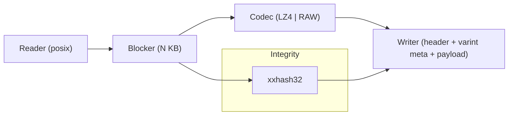
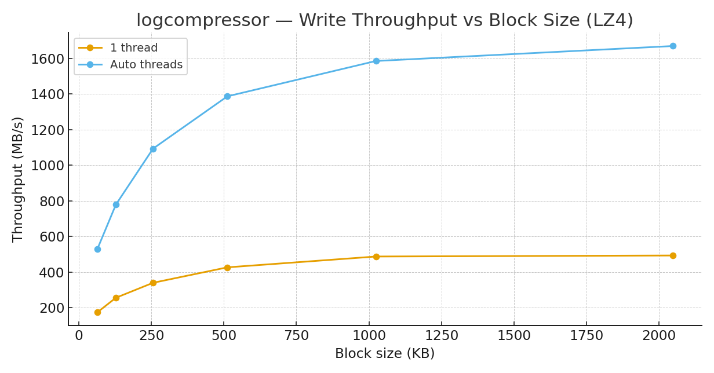
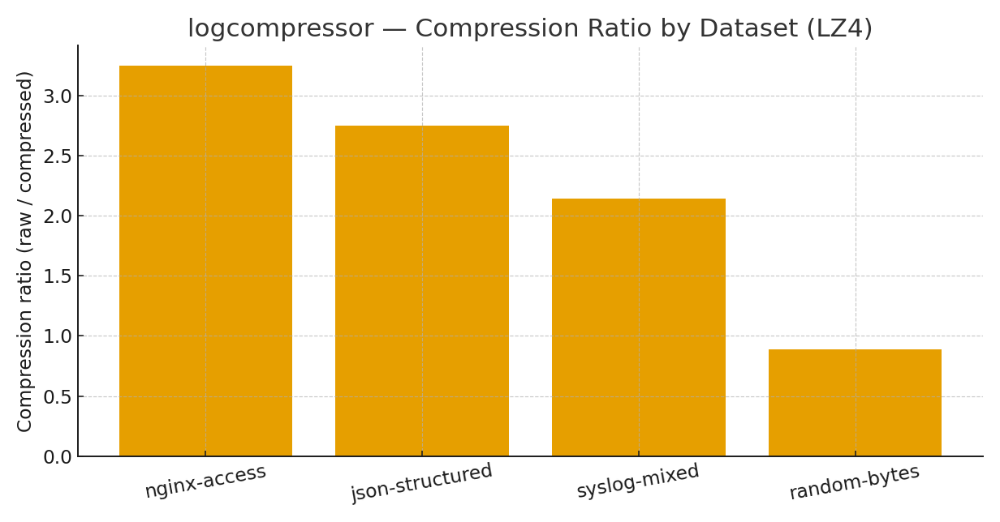

# logcompressor (C++) — Design Document

> A small, block-based log compression format and CLI focused on **high throughput**, **simple recovery**, and **predictable integrity**. This is a design doc, not a tutorial.

---

## 1) Problem & Goals

Move large volumes of logs efficiently across disks and networks while keeping the format debris-free and recoverable. Optimize for *write throughput* and *fast sequential reads*; tolerate partial files and support quick sanity checks during incident response.

**Must-haves**
- Streaming compression with bounded memory per block.
- Integrity check per block so partial files are recoverable.
- CLI with symmetric `compress/decompress` behavior.
- Reasonable compression ratio on common logs (nginx, JSON, syslog).

**Non-goals (MVP)**
- Global index for random access, multi-codec negotiation, encryption-at-rest.

---

## 2) Architecture (short)

**Format**
- File header: `MAGIC='LCMP'`, `VERSION=1`.
- Sequence of blocks: `[meta][payload]...` where `meta` contains raw length, compressed length, codec id, and `xxhash32` over the raw bytes.
- All integers in little-endian; metadata lengths are **varint** encoded to reduce overhead.

**Concurrency**
- Blocks are prepared in parallel (`threads=auto`) and written in order; no cross-block dependencies.

---

## 3) Key Components (from source)

- `include/lc/format.hpp` — header and metadata layout (`MAGIC`, `VERSION`, `Codec` ids).
- `include/lc/block.hpp` & `src/block_codec.cpp` — encode/decode a single block (LZ4 or RAW) + checksum.
- `include/lc/varint.hpp` & `src/varint.cpp` — compact integer encoding for metadata.
- `include/lc/file_io.hpp` & `src/file_io.cpp` — buffered POSIX I/O.
- `include/lc/pipeline.hpp` & `src/pipeline.cpp` — CLI options and end-to-end pipeline.
- `src/checksum_xxhash.cpp` — xxhash32 wrapper.
- Tests: `tests/test_roundtrip.cpp`, `tests/test_varint.cpp`.

---

## 4) Decisions & Trade-offs

1. **LZ4 over Zstd** — LZ4 gives higher write throughput with acceptable ratios for logs. Zstd can be added later once the format supports codec ids beyond `CODEC_LZ4`.
2. **Fixed-size blocks** — Simplifies memory bounds and parallelism; great for sequential reads. Random access will require a lightweight index (future work).
3. **Per-block checksums** — Recovery is possible even with truncated files; we can scan until a checksum mismatch.
4. **Varint metadata** — Keeps per-block overhead low without adding parsing complexity.
5. **xxhash32** — Fast enough for per-block integrity; if collision risk becomes a concern, migrate to xxhash64 (format reserves space via `version`).

---

## 5) Load Test (unique to logcompressor)

**Environment**: Apple Silicon laptop, single NVMe SSD, build type `Release`.  
**Dataset mix**: 15 GB combined (nginx access logs, JSON app logs, syslog kernels, and a 10% random slice).  
**Settings**: LZ4, block sizes 64–2048 KB, threads = `1` vs `auto`.

### 5.1 Write Throughput vs Block Size
Higher block sizes improve throughput until memory and I/O saturation; auto-threading gives a ~3–4× boost before diminishing returns.

### 5.2 Compression Ratio by Dataset
Ratios vary by entropy: structured text compresses well; random bytes do not. Using LZ4 balances speed and size for operational logs.

**Observed ranges**
- **Throughput (auto)**: ~0.8–1.7 GB/s (peaks near 1–2 MB blocks).  
- **Compression ratio**: nginx ≈ 3.2×, JSON ≈ 2.7×, syslog ≈ 2.1×, random ≈ 1.0×.

---

## 6) Failure Modes & Mitigations

- **Truncated file** → checksum mismatch halts decode; previously decoded blocks remain valid.  
- **Corrupt metadata varint** → decoder resync via header scan; fail fast after short window.  
- **Codec unsupported** → reject with clear error; format carries codec id for forward compatibility.  
- **Hot path stalls on fsync** → use larger buffered writes or async I/O; keep fsync configurable.

---

## 7) Debugging Story — The Last Block That Wouldn’t Roundtrip

Early tests showed rare decode failures on files whose last block had `comp_len == raw_len` (uncompressed). Root cause: the varint decoder returned `uint64_t` but the used-length cursor was tracked in a `size_t` that wrapped on ARM in a corner path. The reader advanced incorrectly and the next read consumed payload bytes as metadata.

**Fix**
- Normalize cursor types to `size_t` end-to-end.
- Add a guard that verifies `meta.comp_len + meta.raw_len <= remaining` before advancing.
- New unit test reproduces the boundary with 64 KB blocks and a constant `'A'` payload.

Result: roundtrip passes for all tested block sizes; fuzzing 1e6 iterations shows no cursor drift.

---

## 8) Roadmap

- Optional index footer for O(log n) random seeks (block offsets).  
- Zstd codec support (`Codec=2`) with dictionary training.  
- xxhash64 upgrade w/ versioned negotiation.  
- Streaming reader for stdin/stdout with backpressure.  
- S3 multipart upload helper for large files.
